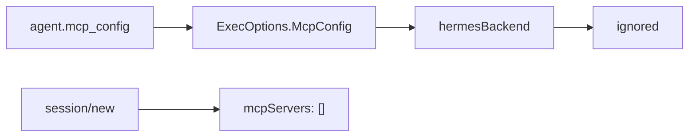

# Hermes 的 MCP 注入方式

本文说明 Multica 中 Hermes provider 当前和 MCP 配置的关系。

## 结论

Hermes 当前 **没有真正接入 agent 级 MCP 配置**。

代码里虽然 Hermes ACP 的 `session/new` 参数包含：

```json
{
  "mcpServers": []
}
```

但它固定是空数组，并没有把 `agent.mcp_config` 转换进去。

当前实际链路是：

```text
agent.mcp_config
  -> daemon ExecOptions.McpConfig
  -> hermesBackend 忽略
  -> session/new mcpServers: []
```

所以，和 Claude Code 不同，Hermes 目前不能通过 Multica agent 设置注入 MCP server。

## Hermes 启动方式

Multica 启动 Hermes 的命令是：

```text
hermes acp
```

对应代码：

- `server/pkg/agent/hermes.go`

Multica 通过 ACP JSON-RPC 2.0 over stdin/stdout 和 Hermes 通信。

## session/new 当前参数

Hermes 创建 session 时，Multica 调用：

```go
c.request(runCtx, "session/new", buildHermesSessionParams(cwd, opts.Model))
```

`buildHermesSessionParams` 当前返回：

```go
params := map[string]any{
    "cwd":        cwd,
    "mcpServers": []any{},
}
if model != "" {
    params["model"] = model
}
```

对应 JSON 形态：

```json
{
  "cwd": "/path/to/task/workdir",
  "mcpServers": [],
  "model": "provider:model"
}
```

如果没有模型：

```json
{
  "cwd": "/path/to/task/workdir",
  "mcpServers": []
}
```

## agent.mcp_config 当前不会进入 Hermes

通用执行选项里有：

```go
type ExecOptions struct {
    ...
    McpConfig json.RawMessage
}
```

daemon 执行任务前也会设置：

```go
execOpts := agent.ExecOptions{
    ...
    McpConfig: mcpConfig,
}
```

但是 `hermesBackend.Execute` 当前没有读取 `opts.McpConfig`。

Hermes 的 `session/new` 只调用：

```go
buildHermesSessionParams(cwd, opts.Model)
```

没有把 MCP 配置传进去。

## 和 Claude Code 的差异

Claude Code 的实现是：

```text
agent.mcp_config
  -> 写临时 JSON 文件
  -> claude --mcp-config <file> --strict-mcp-config
```

Hermes 当前实现是：

```text
agent.mcp_config
  -> 未使用
  -> session/new mcpServers: []
```

因此如果用户在 Hermes agent 设置里填 `mcp_config`，当前不会对 Hermes 任务生效。

## 和 Codex 的差异

Codex 当前也不消费 `agent.mcp_config`，但 Codex 有另一条隐式路径：

```text
~/.codex/config.toml
  -> per-task CODEX_HOME/config.toml
  -> Codex 读取 [mcp_servers.*]
```

Hermes 当前没有类似 `CODEX_HOME/config.toml` 的 Multica 注入链路。Hermes 是否从自己的全局配置读取 MCP server，取决于 Hermes CLI 自身能力；Multica 当前没有在代码里为 Hermes 准备或改写这类配置。

## 当前 Hermes MCP 数据流



## 如果要实现 Hermes MCP 注入

要让 Hermes 支持 Multica agent 级 MCP，建议实现以下链路：

```text
agent.mcp_config JSONB
  -> daemon task.Agent.McpConfig
  -> ExecOptions.McpConfig
  -> hermesBackend 解析
  -> session/new mcpServers
```

### 1. 扩展 buildHermesSessionParams

当前函数签名：

```go
func buildHermesSessionParams(cwd, model string) map[string]any
```

可以改成：

```go
func buildHermesSessionParams(cwd, model string, mcpConfig json.RawMessage) map[string]any
```

然后从 `mcpConfig` 里提取 MCP server 列表。

### 2. 明确 JSON 到 ACP mcpServers 的转换格式

Multica agent `mcp_config` 通常是 Claude 风格：

```json
{
  "mcpServers": {
    "filesystem": {
      "command": "npx",
      "args": ["-y", "@modelcontextprotocol/server-filesystem", "/tmp"],
      "env": {
        "FOO": "bar"
      }
    }
  }
}
```

Hermes ACP `session/new.mcpServers` 当前从字段名看是数组：

```json
{
  "mcpServers": []
}
```

因此需要确认 Hermes ACP 期望的 server item schema，例如是否是：

```json
{
  "name": "filesystem",
  "command": "npx",
  "args": ["-y", "@modelcontextprotocol/server-filesystem", "/tmp"],
  "env": {
    "FOO": "bar"
  }
}
```

或者是否需要其他字段。这个 schema 需要以 Hermes ACP 实现为准。

### 3. 调整 Execute 中的调用

当前：

```go
result, err := c.request(runCtx, "session/new", buildHermesSessionParams(cwd, opts.Model))
```

目标：

```go
result, err := c.request(runCtx, "session/new", buildHermesSessionParams(cwd, opts.Model, opts.McpConfig))
```

### 4. 添加测试

至少需要覆盖：

- 无 MCP 配置时仍发送 `mcpServers: []`。
- 有 MCP 配置时转换为 Hermes ACP `mcpServers`。
- malformed MCP JSON 时任务失败或安全降级。
- secret 不出现在普通日志里。

相关测试可参考：

- `server/pkg/agent/hermes_test.go`
- `server/pkg/agent/claude_test.go`

## 当前能做什么

当前源码下，如果你要给 Hermes 使用 MCP，有两种可能：

1. 如果 Hermes CLI 自己支持全局 MCP 配置，可以在 Hermes 自己的配置系统里配置，Multica 不参与。
2. 如果希望通过 Multica agent 设置配置 MCP，需要先实现上面描述的代码改造。

不要误以为在 Multica agent 的 `mcp_config` 里填内容就能让 Hermes 读到。当前代码不会传。

## 一句话总结

Hermes backend 当前只在 ACP `session/new` 里发送空的 `mcpServers: []`，没有把 Multica 的 `agent.mcp_config` 注入 Hermes；要实现 agent 级 MCP，需要把 `ExecOptions.McpConfig` 转换成 Hermes ACP 期望的 `mcpServers` 数组并传入 `session/new`。
